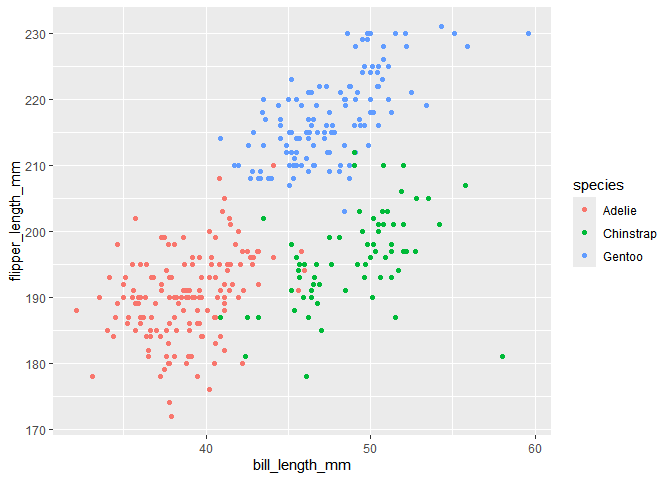

p8105_hw1_ws2721
================
WooJin Shin
2024-09-18

**Problem 1**

``` r
data("penguins", package = "palmerpenguins")
```

Pulling the data

``` r
library(skimr)
skimr::skim(penguins)
```

This works and gives most of the information I need, but I could do
more.

``` r
head(penguins)
```

    ## # A tibble: 6 × 8
    ##   species island    bill_length_mm bill_depth_mm flipper_length_mm body_mass_g
    ##   <fct>   <fct>              <dbl>         <dbl>             <int>       <int>
    ## 1 Adelie  Torgersen           39.1          18.7               181        3750
    ## 2 Adelie  Torgersen           39.5          17.4               186        3800
    ## 3 Adelie  Torgersen           40.3          18                 195        3250
    ## 4 Adelie  Torgersen           NA            NA                  NA          NA
    ## 5 Adelie  Torgersen           36.7          19.3               193        3450
    ## 6 Adelie  Torgersen           39.3          20.6               190        3650
    ## # ℹ 2 more variables: sex <fct>, year <int>

``` r
nrow(penguins)
```

    ## [1] 344

``` r
ncol(penguins)
```

    ## [1] 8

``` r
mean(penguins[["flipper_length_mm"]], na.rm = TRUE)
```

    ## [1] 200.9152

According to `head(penguins)` and `nrow(penguins)` and `ncol(penguins)`:

There are total of 344 rows and 8 columns, which means there are 344
observations and 8 variables.

There are 8 variables consist of 3 factor variable type, 3 integer
variable type and 2 double variable type.

3 factor variables are “species”, “island”, and “sex”.

3 integer variables are “flipper_length_mm”, “body_mass_g”, and “year”.

2 double variables are “bill_length_mm” and “bill_depth_mm”.

The mean of flipper length is 200.9152, with 2 values missing and not
included.

``` r
library(ggplot2)
ggplot(penguins, aes(y = flipper_length_mm, x = bill_length_mm, color = species)) + geom_point(na.rm = TRUE)
```

<!-- -->

Removed 2 missing values from flipper_length and bill_length.

**problem 2**
